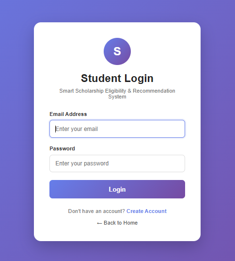
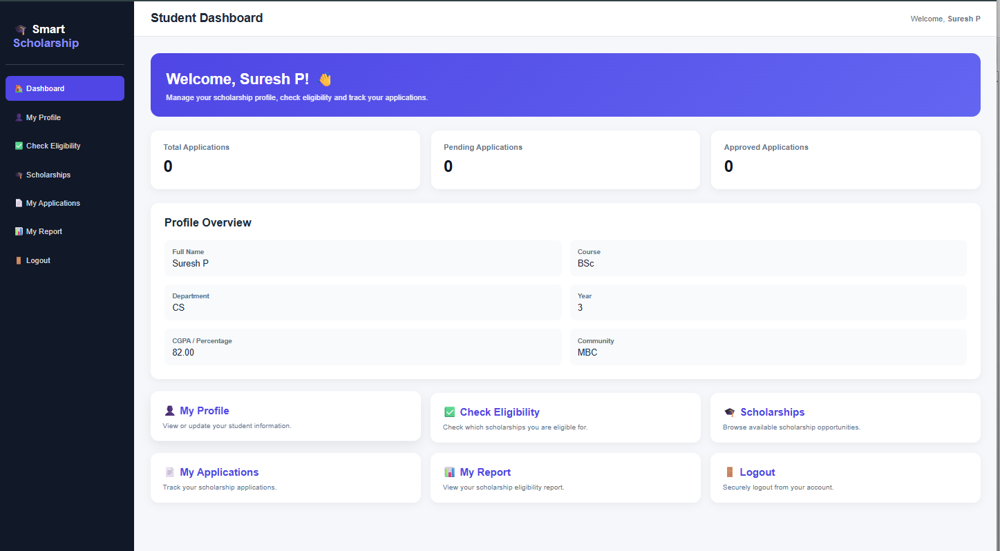
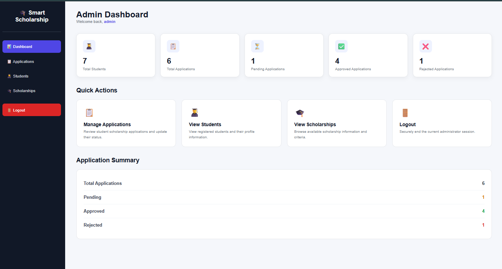

# Smart Scholarship Eligibility & Recommendation System

## Project Overview

The Smart Scholarship Eligibility & Recommendation System is a web-based application that helps students identify scholarships they may be eligible for. It analyzes academic performance, annual family income, course, department, community, gender, and disability status to recommend suitable scholarships.

The system also supports online scholarship applications, application status tracking, student reports, and an admin dashboard for managing students and reviewing applications.

## Features

### Student Module

- Student registration and login
- Student profile management
- Automatic scholarship eligibility checking
- Scholarship recommendation
- Online scholarship application
- Application status tracking
- Student report generation

### Admin Module

- Secure admin login
- Admin dashboard with statistics
- Student management
- Scholarship application management
- Approve or reject applications
- Add remarks to applications
- Search and filter students
- Search and filter applications
- Export student data as CSV
- Export application data as CSV

## Technologies Used

- HTML
- CSS
- JavaScript
- PHP
- MySQL
- XML
- XAMPP

## System Workflow

```text
Student Registration
        ↓
Student Login
        ↓
Profile Creation
        ↓
Eligibility Checking
        ↓
Scholarship Recommendation
        ↓
Application
        ↓
Admin Review
        ↓
Approve / Reject
        ↓
Application Status
        ↓
Report Generation
```

## Eligibility Criteria

The system evaluates scholarship eligibility using criteria such as:

- Academic performance
- Annual family income
- Course
- Department
- Community
- Gender
- Disability status

Scholarship eligibility rules are maintained using XML.

## Database

MySQL is used to store:

- Student accounts
- Student profiles
- Scholarship applications
- Admin accounts

## Project Structure

```text
smart-scholarship/
│
├── admin/
│   ├── login.php
│   ├── dashboard.php
│   ├── applications.php
│   ├── students.php
│   ├── export_students.php
│   ├── export_applications.php
│   └── logout.php
│
├── includes/
│   └── db.php
│
├── xml/
│   └── scholarships.xml
│
├── index.php
├── register.php
├── login.php
├── dashboard.php
├── profile.php
├── eligibility.php
├── scholarships.php
├── apply.php
├── my_applications.php
├── report.php
└── logout.php
```

## Screenshots

### Student Dashboard



### Scholarship Eligibility



### Admin Dashboard



## How to Run

1. Install XAMPP.
2. Start Apache and MySQL/MariaDB.
3. Place the project inside:

```text
C:\xampp\htdocs\
```

4. Create the database using `database.sql`.
5. Check the database configuration in:

```text
includes/db.php
```

6. Open the project in a browser:

```text
http://localhost/smart-scholarship/
```

## Future Enhancements

- Email notifications
- More scholarship providers
- Online document verification
- PDF application download
- Advanced analytics
- Cloud deployment
- Mobile-friendly application

## Author

**Devaki A**

Computer Science and Engineering
